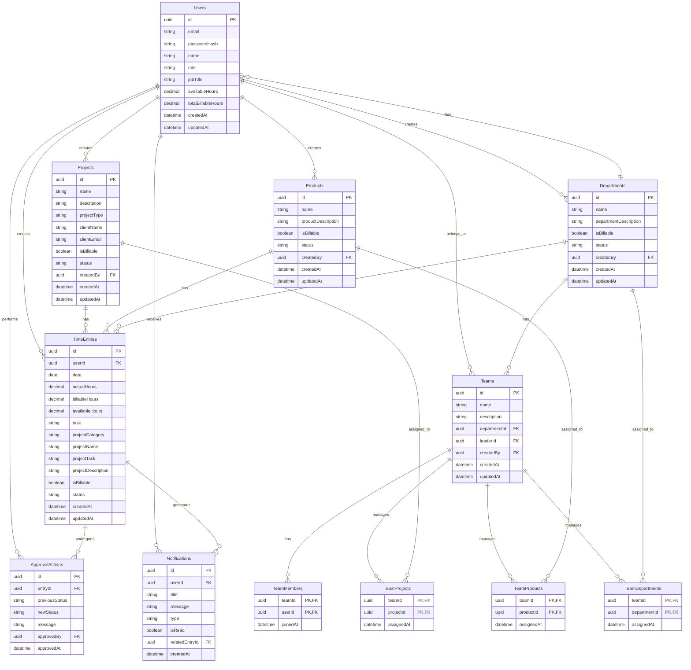

# Updated Database Schema - TimeFlow Application

## Overview
This document provides the updated database schema for the TimeFlow application after removing hierarchical structures (levels, stages, functions, duties, subtasks) and billable rates. The schema is simplified and optimized for better performance and maintainability.

## Database Tables

### 1. Users Table
```sql
CREATE TABLE Users (
    Id UNIQUEIDENTIFIER PRIMARY KEY DEFAULT NEWID(),
    Email NVARCHAR(255) NOT NULL UNIQUE,
    PasswordHash NVARCHAR(255) NOT NULL,
    Name NVARCHAR(100) NOT NULL,
    Role NVARCHAR(20) NOT NULL DEFAULT 'employee',
    JobTitle NVARCHAR(100) NOT NULL,
    AvailableHours DECIMAL(5,2) NOT NULL DEFAULT 8.0,
    TotalBillableHours DECIMAL(8,2) NOT NULL DEFAULT 0.0,
    CreatedAt DATETIME2 NOT NULL DEFAULT GETUTCDATE(),
    UpdatedAt DATETIME2 NOT NULL DEFAULT GETUTCDATE()
);

CREATE INDEX IX_Users_Email ON Users(Email);
CREATE INDEX IX_Users_Role ON Users(Role);
```

### 2. Projects Table
```sql
CREATE TABLE Projects (
    Id UNIQUEIDENTIFIER PRIMARY KEY DEFAULT NEWID(),
    Name NVARCHAR(100) NOT NULL,
    Description NVARCHAR(MAX),
    ProjectType NVARCHAR(50) NOT NULL DEFAULT 'Fixed Cost',
    ClientName NVARCHAR(100),
    ClientEmail NVARCHAR(255),
    IsBillable BIT NOT NULL DEFAULT 0,
    Status NVARCHAR(20) NOT NULL DEFAULT 'active',
    CreatedBy UNIQUEIDENTIFIER NOT NULL,
    CreatedAt DATETIME2 NOT NULL DEFAULT GETUTCDATE(),
    UpdatedAt DATETIME2 NOT NULL DEFAULT GETUTCDATE(),
    FOREIGN KEY (CreatedBy) REFERENCES Users(Id)
);

CREATE INDEX IX_Projects_Status ON Projects(Status);
CREATE INDEX IX_Projects_IsBillable ON Projects(IsBillable);
CREATE INDEX IX_Projects_CreatedBy ON Projects(CreatedBy);
```

### 3. Products Table
```sql
CREATE TABLE Products (
    Id UNIQUEIDENTIFIER PRIMARY KEY DEFAULT NEWID(),
    Name NVARCHAR(100) NOT NULL,
    ProductDescription NVARCHAR(MAX),
    IsBillable BIT NOT NULL DEFAULT 0,
    Status NVARCHAR(20) NOT NULL DEFAULT 'active',
    CreatedBy UNIQUEIDENTIFIER NOT NULL,
    CreatedAt DATETIME2 NOT NULL DEFAULT GETUTCDATE(),
    UpdatedAt DATETIME2 NOT NULL DEFAULT GETUTCDATE(),
    FOREIGN KEY (CreatedBy) REFERENCES Users(Id)
);

CREATE INDEX IX_Products_Status ON Products(Status);
CREATE INDEX IX_Products_IsBillable ON Products(IsBillable);
CREATE INDEX IX_Products_CreatedBy ON Products(CreatedBy);
```

### 4. Departments Table
```sql
CREATE TABLE Departments (
    Id UNIQUEIDENTIFIER PRIMARY KEY DEFAULT NEWID(),
    Name NVARCHAR(100) NOT NULL,
    DepartmentDescription NVARCHAR(MAX),
    IsBillable BIT NOT NULL DEFAULT 0,
    Status NVARCHAR(20) NOT NULL DEFAULT 'active',
    CreatedBy UNIQUEIDENTIFIER NOT NULL,
    CreatedAt DATETIME2 NOT NULL DEFAULT GETUTCDATE(),
    UpdatedAt DATETIME2 NOT NULL DEFAULT GETUTCDATE(),
    FOREIGN KEY (CreatedBy) REFERENCES Users(Id)
);

CREATE INDEX IX_Departments_Status ON Departments(Status);
CREATE INDEX IX_Departments_IsBillable ON Departments(IsBillable);
CREATE INDEX IX_Departments_CreatedBy ON Departments(CreatedBy);
```

### 5. Teams Table
```sql
CREATE TABLE Teams (
    Id UNIQUEIDENTIFIER PRIMARY KEY DEFAULT NEWID(),
    Name NVARCHAR(100) NOT NULL,
    Description NVARCHAR(MAX),
    DepartmentId UNIQUEIDENTIFIER NOT NULL,
    LeaderId UNIQUEIDENTIFIER,
    CreatedBy UNIQUEIDENTIFIER NOT NULL,
    CreatedAt DATETIME2 NOT NULL DEFAULT GETUTCDATE(),
    UpdatedAt DATETIME2 NOT NULL DEFAULT GETUTCDATE(),
    FOREIGN KEY (DepartmentId) REFERENCES Departments(Id),
    FOREIGN KEY (LeaderId) REFERENCES Users(Id),
    FOREIGN KEY (CreatedBy) REFERENCES Users(Id)
);

CREATE INDEX IX_Teams_DepartmentId ON Teams(DepartmentId);
CREATE INDEX IX_Teams_LeaderId ON Teams(LeaderId);
CREATE INDEX IX_Teams_CreatedBy ON Teams(CreatedBy);
```

### 6. TeamMembers Table
```sql
CREATE TABLE TeamMembers (
    TeamId UNIQUEIDENTIFIER NOT NULL,
    UserId UNIQUEIDENTIFIER NOT NULL,
    JoinedAt DATETIME2 NOT NULL DEFAULT GETUTCDATE(),
    PRIMARY KEY (TeamId, UserId),
    FOREIGN KEY (TeamId) REFERENCES Teams(Id) ON DELETE CASCADE,
    FOREIGN KEY (UserId) REFERENCES Users(Id) ON DELETE CASCADE
);

CREATE INDEX IX_TeamMembers_TeamId ON TeamMembers(TeamId);
CREATE INDEX IX_TeamMembers_UserId ON TeamMembers(UserId);
```

### 7. TeamProjects Table
```sql
CREATE TABLE TeamProjects (
    TeamId UNIQUEIDENTIFIER NOT NULL,
    ProjectId UNIQUEIDENTIFIER NOT NULL,
    AssignedAt DATETIME2 NOT NULL DEFAULT GETUTCDATE(),
    PRIMARY KEY (TeamId, ProjectId),
    FOREIGN KEY (TeamId) REFERENCES Teams(Id) ON DELETE CASCADE,
    FOREIGN KEY (ProjectId) REFERENCES Projects(Id) ON DELETE CASCADE
);

CREATE INDEX IX_TeamProjects_TeamId ON TeamProjects(TeamId);
CREATE INDEX IX_TeamProjects_ProjectId ON TeamProjects(ProjectId);
```

### 8. TeamProducts Table
```sql
CREATE TABLE TeamProducts (
    TeamId UNIQUEIDENTIFIER NOT NULL,
    ProductId UNIQUEIDENTIFIER NOT NULL,
    AssignedAt DATETIME2 NOT NULL DEFAULT GETUTCDATE(),
    PRIMARY KEY (TeamId, ProductId),
    FOREIGN KEY (TeamId) REFERENCES Teams(Id) ON DELETE CASCADE,
    FOREIGN KEY (ProductId) REFERENCES Products(Id) ON DELETE CASCADE
);

CREATE INDEX IX_TeamProducts_TeamId ON TeamProducts(TeamId);
CREATE INDEX IX_TeamProducts_ProductId ON TeamProducts(ProductId);
```

### 9. TeamDepartments Table
```sql
CREATE TABLE TeamDepartments (
    TeamId UNIQUEIDENTIFIER NOT NULL,
    DepartmentId UNIQUEIDENTIFIER NOT NULL,
    AssignedAt DATETIME2 NOT NULL DEFAULT GETUTCDATE(),
    PRIMARY KEY (TeamId, DepartmentId),
    FOREIGN KEY (TeamId) REFERENCES Teams(Id) ON DELETE CASCADE,
    FOREIGN KEY (DepartmentId) REFERENCES Departments(Id) ON DELETE CASCADE
);

CREATE INDEX IX_TeamDepartments_TeamId ON TeamDepartments(TeamId);
CREATE INDEX IX_TeamDepartments_DepartmentId ON TeamDepartments(DepartmentId);
```

### 10. TimeEntries Table
```sql
CREATE TABLE TimeEntries (
    Id UNIQUEIDENTIFIER PRIMARY KEY DEFAULT NEWID(),
    UserId UNIQUEIDENTIFIER NOT NULL,
    Date DATE NOT NULL,
    ActualHours DECIMAL(5,2) NOT NULL,
    BillableHours DECIMAL(5,2) NOT NULL,
    AvailableHours DECIMAL(5,2) NOT NULL,
    Task NVARCHAR(MAX) NOT NULL,
    ProjectCategory NVARCHAR(20) NOT NULL, -- 'project', 'product', 'department'
    ProjectName NVARCHAR(100) NOT NULL,
    ProjectTask NVARCHAR(100),
    ProjectDescription NVARCHAR(MAX),
    IsBillable BIT NOT NULL,
    Status NVARCHAR(20) NOT NULL DEFAULT 'pending',
    CreatedAt DATETIME2 NOT NULL DEFAULT GETUTCDATE(),
    UpdatedAt DATETIME2 NOT NULL DEFAULT GETUTCDATE(),
    FOREIGN KEY (UserId) REFERENCES Users(Id)
);

CREATE INDEX IX_TimeEntries_UserId ON TimeEntries(UserId);
CREATE INDEX IX_TimeEntries_Date ON TimeEntries(Date);
CREATE INDEX IX_TimeEntries_Status ON TimeEntries(Status);
CREATE INDEX IX_TimeEntries_ProjectCategory ON TimeEntries(ProjectCategory);
CREATE INDEX IX_TimeEntries_ProjectName ON TimeEntries(ProjectName);
```

### 11. Notifications Table
```sql
CREATE TABLE Notifications (
    Id UNIQUEIDENTIFIER PRIMARY KEY DEFAULT NEWID(),
    UserId UNIQUEIDENTIFIER NOT NULL,
    Title NVARCHAR(255) NOT NULL,
    Message NVARCHAR(MAX) NOT NULL,
    Type NVARCHAR(50) NOT NULL,
    IsRead BIT NOT NULL DEFAULT 0,
    RelatedEntryId UNIQUEIDENTIFIER,
    CreatedAt DATETIME2 NOT NULL DEFAULT GETUTCDATE(),
    FOREIGN KEY (UserId) REFERENCES Users(Id),
    FOREIGN KEY (RelatedEntryId) REFERENCES TimeEntries(Id)
);

CREATE INDEX IX_Notifications_UserId ON Notifications(UserId);
CREATE INDEX IX_Notifications_IsRead ON Notifications(IsRead);
CREATE INDEX IX_Notifications_CreatedAt ON Notifications(CreatedAt);
```

### 12. ApprovalActions Table
```sql
CREATE TABLE ApprovalActions (
    Id UNIQUEIDENTIFIER PRIMARY KEY DEFAULT NEWID(),
    EntryId UNIQUEIDENTIFIER NOT NULL,
    PreviousStatus NVARCHAR(20) NOT NULL,
    NewStatus NVARCHAR(20) NOT NULL,
    Message NVARCHAR(MAX),
    ApprovedBy UNIQUEIDENTIFIER NOT NULL,
    ApprovedAt DATETIME2 NOT NULL DEFAULT GETUTCDATE(),
    FOREIGN KEY (EntryId) REFERENCES TimeEntries(Id),
    FOREIGN KEY (ApprovedBy) REFERENCES Users(Id)
);

CREATE INDEX IX_ApprovalActions_EntryId ON ApprovalActions(EntryId);
CREATE INDEX IX_ApprovalActions_ApprovedBy ON ApprovalActions(ApprovedBy);
CREATE INDEX IX_ApprovalActions_ApprovedAt ON ApprovalActions(ApprovedAt);
```

## Entity Relationship Diagram



## Key Changes from Previous Schema

### Removed Elements:
1. **BillableRate** - Removed from Users table
2. **Hierarchical Structures**:
   - ProjectLevels, ProjectTasks, ProjectSubtasks tables
   - ProductStages, ProductTasks, ProductSubtasks tables
   - DepartmentFunctions, DepartmentDuties, DepartmentSubduties tables

### Simplified Structure:
1. **TimeEntries** - Now stores project details directly in the table instead of referencing hierarchical structures
2. **Project Details** - Stored as simple fields: category, name, task, description
3. **Team Associations** - Many-to-many relationships for projects, products, and departments

### Benefits:
1. **Simplified Queries** - No complex joins through hierarchical tables
2. **Better Performance** - Fewer table joins and simpler data access patterns
3. **Easier Maintenance** - Less complex data structure
4. **Flexible Task Management** - Tasks are stored directly with time entries
5. **Improved Scalability** - Simpler schema scales better

## Data Access Patterns

### Common Queries:

1. **Get User Time Entries**:
```sql
SELECT * FROM TimeEntries WHERE UserId = @userId
```

2. **Get Team Statistics**:
```sql
SELECT 
    t.Name as TeamName,
    COUNT(tm.UserId) as MemberCount,
    SUM(te.ActualHours) as TotalActualHours,
    SUM(te.BillableHours) as TotalBillableHours
FROM Teams t
LEFT JOIN TeamMembers tm ON t.Id = tm.TeamId
LEFT JOIN TimeEntries te ON tm.UserId = te.UserId
WHERE t.Id = @teamId
GROUP BY t.Id, t.Name
```

3. **Get Project Time Entries**:
```sql
SELECT * FROM TimeEntries 
WHERE ProjectCategory = 'project' AND ProjectName = @projectName
```

4. **Get User Statistics**:
```sql
SELECT 
    u.Name,
    SUM(te.ActualHours) as TotalActualHours,
    SUM(te.BillableHours) as TotalBillableHours,
    COUNT(te.Id) as TotalEntries,
    SUM(CASE WHEN te.Status = 'approved' THEN 1 ELSE 0 END) as ApprovedEntries,
    SUM(CASE WHEN te.Status = 'pending' THEN 1 ELSE 0 END) as PendingEntries
FROM Users u
LEFT JOIN TimeEntries te ON u.Id = te.UserId
WHERE u.Id = @userId
GROUP BY u.Id, u.Name
```

## Migration Strategy

### From Hierarchical to Flat Structure:

1. **Extract Project Details**: Move data from hierarchical tables to flat structure in TimeEntries
2. **Update Application Code**: Modify queries to use new flat structure
3. **Data Migration Scripts**: Create scripts to migrate existing data
4. **Validation**: Ensure data integrity after migration
5. **Testing**: Verify all functionality works with new schema

### Migration Script Example:
```sql
-- Migrate project details to TimeEntries
UPDATE TimeEntries 
SET 
    ProjectCategory = 'project',
    ProjectName = p.Name,
    ProjectTask = pt.Name,
    ProjectDescription = pt.Description
FROM TimeEntries te
JOIN Projects p ON te.ProjectId = p.Id
JOIN ProjectLevels pl ON p.Id = pl.ProjectId
JOIN ProjectTasks pt ON pl.Id = pt.LevelId
WHERE te.ProjectId IS NOT NULL;
```

This updated schema provides a cleaner, more maintainable structure while preserving all essential functionality of the TimeFlow application.
