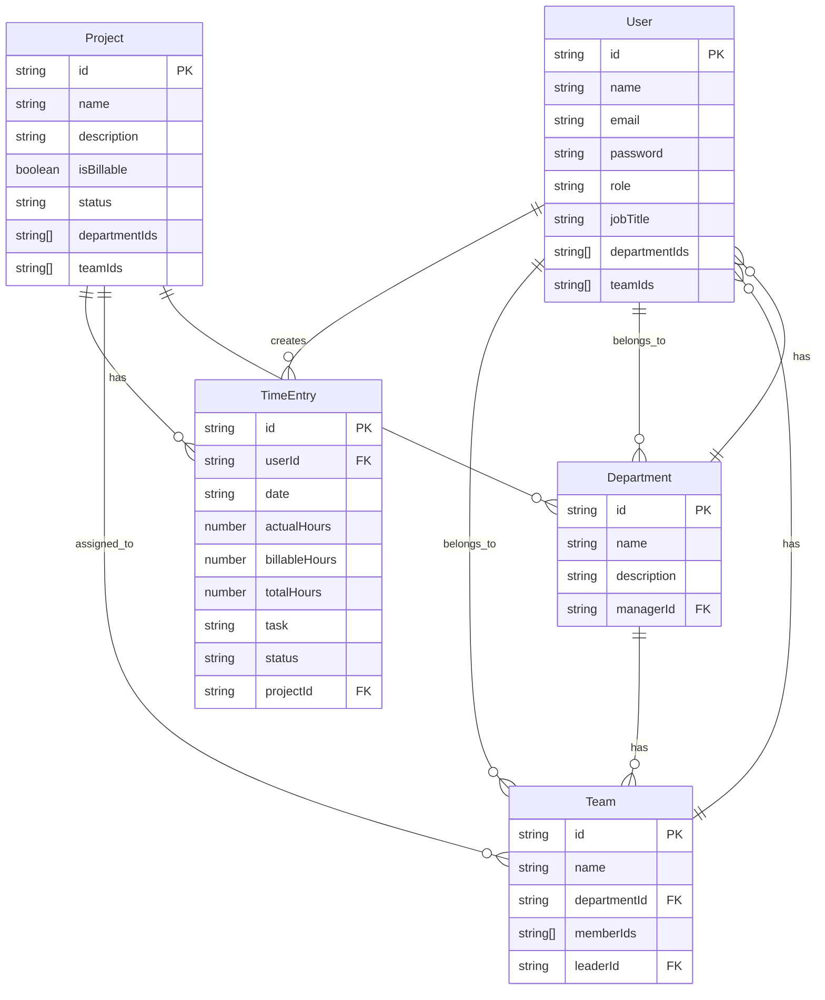
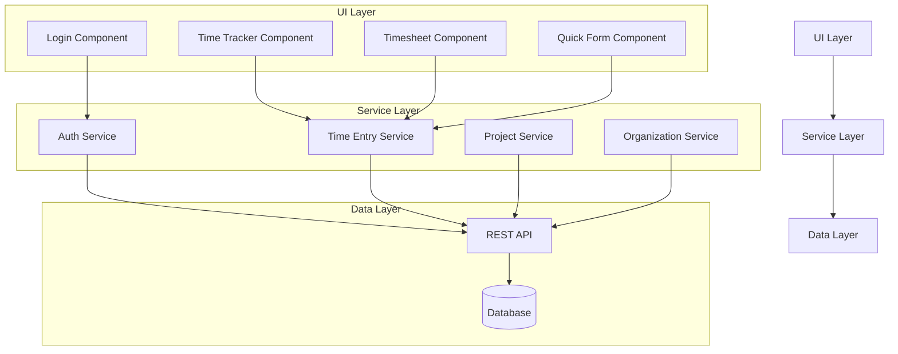

# TimeFlow - Time Tracking System Documentation
*Last Updated: August 7, 2025*

## API Requirements and Data Architecture

### Required APIs

#### Authentication APIs
```typescript
POST /api/auth/login
Request: {
  email: string
  password: string
}
Response: {
  token: string
  user: User
}

POST /api/auth/logout
Response: { success: boolean }

GET /api/auth/user
Response: User

GET /api/users
Response: User[]
```

#### Time Entry APIs
```typescript
GET /api/time-entries
Query Parameters: {
  userId?: string
  startDate?: string
  endDate?: string
  status?: 'pending' | 'approved' | 'rejected'
}
Response: TimeEntry[]

POST /api/time-entries
Request: {
  userId: string
  date: string
  actualHours: number
  billableHours: number
  task: string
  projectId: string
}
Response: TimeEntry

PUT /api/time-entries/:id
Request: {
  actualHours?: number
  billableHours?: number
  task?: string
  status?: string
}
Response: TimeEntry

DELETE /api/time-entries/:id
Response: { success: boolean }

GET /api/time-entries/status/:date
Response: {
  hasEntries: boolean
  entriesCount: number
  totalHours: number
  statuses: string[]
}
```

#### Project Management APIs
```typescript
GET /api/projects
Query Parameters: {
  departmentId?: string
  teamId?: string
}
Response: Project[]

POST /api/projects
Request: {
  name: string
  description: string
  isBillable: boolean
  departmentIds: string[]
  teamIds: string[]
}
Response: Project

PUT /api/projects/:id
Request: Project
Response: Project

DELETE /api/projects/:id
Response: { success: boolean }

GET /api/projects/user/:userId
Response: Project[]
```

#### Organization APIs
```typescript
GET /api/departments
Response: Department[]

GET /api/teams
Query Parameters: {
  departmentId?: string
}
Response: Team[]

GET /api/products
Response: Product[]
```

### Data Schema

#### Users Collection
```typescript
interface User {
  id: string
  name: string
  email: string
  password: string // hashed
  role: 'owner' | 'manager' | 'employee'
  jobTitle: string
  departmentIds: string[]
  teamIds: string[]
  createdAt: Date
  updatedAt: Date
}
```

#### TimeEntries Collection
```typescript
interface TimeEntry {
  id: string
  userId: string
  userName: string
  date: string
  actualHours: number
  billableHours: number
  totalHours: number
  availableHours: number
  task: string
  projectDetails: {
    category: string
    name: string
    level: string
    task: string
    subtask: string
    description: string
  }
  isBillable: boolean
  status: 'pending' | 'approved' | 'rejected'
  createdAt: string
  updatedAt: string
}
```

#### Projects Collection
```typescript
interface Project {
  id: string
  name: string
  description: string
  isBillable: boolean
  status: 'active' | 'inactive'
  departmentIds: string[]
  teamIds: string[]
  createdAt: Date
  updatedAt: Date
}
```

#### Departments Collection
```typescript
interface Department {
  id: string
  name: string
  description: string
  managerId: string
  createdAt: Date
  updatedAt: Date
}
```

#### Teams Collection
```typescript
interface Team {
  id: string
  name: string
  departmentId: string
  memberIds: string[]
  leaderId: string
  createdAt: Date
  updatedAt: Date
}
```

### Entity Relationship Diagram


### Data Flow Architecture


## Original Documentation

### Overview
TimeFlow is a comprehensive time tracking and project management system designed for organizations to track employee work hours, manage projects, and handle approval workflows. The system supports multiple user roles with different permission levels and provides detailed reporting capabilities.

## Features & Functionalities

### 🔐 Authentication & User Management
- **Multi-role system**: Owner, Manager, Employee
- **User profiles** with job titles and billable rates
- **Available hours tracking** per user
- **Role-based permissions** controlling feature access

### ⏰ Time Tracking System

#### Time Entry Methods
1. **Simple Entry Form** (1st Approach)
   - Single time entry with project/product/department selection
   - Automatic billable status determination
   - Task description with available hours tracking

2. **Daily Tracker Form** (Advanced)
   - Multiple project entries per day
   - Real-time hour calculations
   - Hierarchical project structure (Levels → Tasks → Subtasks)
   - Break time management
   - Billable/non-billable hour tracking

3. **Weekly Time Tracker**
   - Week-view time entry interface
   - Bulk entry capabilities

4. **Monthly Time Tracker**
   - Month-view time tracking
   - Monthly summary reports

#### Time Entry Features
- **Project categorization**: Projects, Products, Departments
- **Hierarchical task structure**:
  - Projects: Levels → Tasks → Subtasks
  - Products: Stages → Tasks → Subtasks  
  - Departments: Functions → Duties → Tasks
- **Automatic billable calculation** based on project/product/department settings
- **Edit and delete** pending entries
- **Time validation** and hour limits

### 📊 Timesheet Management
- **View all time entries** with filtering and search
- **Status tracking**: Pending, Approved, Rejected
- **Summary statistics**:
  - Total actual hours vs billable hours
  - Daily averages
  - Overtime calculations
  - Days worked tracking
- **Export functionality** to CSV
- **Date range filtering**
- **Employee/project/billable filtering**

### 🏗️ Project & Task Management

#### Project Types
1. **Projects**
   - Multi-level task hierarchy
   - Billable/non-billable designation
   - Created by tracking

2. **Products**
   - Stage-based workflow
   - Task and subtask management
   - Product lifecycle tracking

3. **Departments**
   - Function-based organization
   - Duty and task assignments
   - Department-specific workflows

#### Management Features
- **Create, edit, delete** projects/products/departments
- **Search and filter** capabilities
- **Task hierarchy visualization**
- **Creator and creation date tracking**

### 👥 Team Management
- **Team creation and management**
- **Member assignment** to teams
- **Project/product/department association** with teams
- **Team member statistics**
- **Role-based team views**
- **Team deletion** with confirmation

### ✅ Approval Workflow
- **Pending entry review** for managers/owners
- **Approve/reject functionality** with comments
- **Approval history tracking**
- **Status change notifications**
- **Bulk approval capabilities**
- **Approval statistics dashboard**

### 📈 Reports & Analytics

#### Member Reports
- **Individual user statistics**:
  - Actual vs available hours
  - Billable hours tracking  
  - Entry counts (approved/pending)
  - Performance metrics

#### Team Reports
- **Team-specific analytics**
- **Project association tracking**
- **Team member performance**
- **Date range filtering**
- **Export capabilities**

#### System-Wide Metrics
- **Overtime calculations**
- **Department/project performance**
- **Billable vs non-billable ratios**
- **Approval workflow statistics**

### 🔔 Notification System

#### Daily Reminders
- **6 PM reminder** if no time entry logged for the day
- **Automatic reminder generation**
- **User-specific notifications**

#### Approval Notifications
- **Status change notifications** (approved/rejected)
- **Notification bell** with unread count
- **Mark as read functionality**
- **Notification history**

#### Notification Features
- **Real-time notification bell**
- **Unread notification tracking**
- **Notification categorization** (daily, approval, rejection)
- **Mark all as read** capability
- **Search and filter** notifications

### 🛡️ Role-Based Permissions

#### Employee Permissions
- Create and edit own time entries
- View own timesheet
- Receive notifications

#### Manager Permissions
- All employee permissions
- View all timesheets
- Approve/reject time entries
- Manage teams
- View billable rates

#### Owner Permissions
- All manager permissions
- Manage projects/products/departments
- Delete any entries
- Full system access
- User management

### 🔍 Search & Filtering
- **Global search** across projects, tasks, employees
- **Advanced filtering** by:
  - Date ranges
  - Project/product/department
  - Status (pending/approved/rejected)
  - Employee
  - Billable/non-billable
  - Team assignments

### 📤 Export & Data Management
- **CSV export** functionality
- **Date range exports**
- **Filtered data exports**
- **User-specific exports**
- **Team report exports**

### 🎨 User Interface Features
- **Responsive design** for desktop and mobile
- **Dark/light theme support**
- **Intuitive dashboard** with summary cards
- **Interactive tables** with sorting and pagination
- **Modal dialogs** for forms and confirmations
- **Toast notifications** for user feedback
- **Loading states** and error handling

## Technical Architecture

### Data Management
- **Local storage** for data persistence
- **JSON-based** data structures
- **Hierarchical data organization**
- **Data validation** and type safety

### Component Structure
- **Modular React components**
- **Reusable UI components**
- **Form validation** with error handling
- **State management** with React hooks

### Security Features
- **Role-based access control**
- **Data validation** on all inputs
- **Secure authentication** handling
- **Permission checking** on all operations

## Usage Workflows

### Daily Time Tracking Workflow
1. User logs in to system
2. Navigates to Time Tracker
3. Selects project/product/department
4. Chooses appropriate levels/stages/functions
5. Selects tasks and subtasks
6. Enters hours and descriptions
7. Submits for approval

### Manager Approval Workflow
1. Manager receives notification of pending entries
2. Reviews entries in Approval Workflow
3. Adds approval/rejection comments
4. Approves or rejects entries
5. Employees receive status notifications

### Reporting Workflow
1. Managers/owners access Reports section
2. Select date ranges and filters
3. Review team/individual performance
4. Export data for external analysis
5. Use insights for resource planning

### Project Management Workflow
1. Owners/managers create projects/products/departments
2. Define hierarchical task structures
3. Set billable/non-billable status
4. Assign to teams
5. Monitor usage through reports

This comprehensive system provides organizations with complete time tracking, project management, and workforce analytics capabilities while maintaining security and user-friendly interfaces across all user roles.
