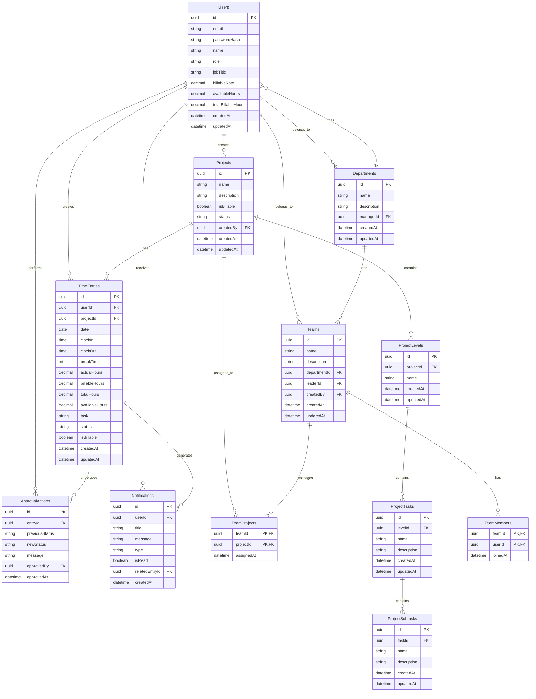

# TimeFlow - Time Tracking System Documentation (Updated)
*Last Updated: August 10, 2025*

## Data Flow Architecture

### Frontend to Backend Data Flow


### Core Data Models Flow

#### User Data Flow


#### Time Entry Data Flow


#### Project/Product/Department Data Flow


#### Team Data Flow


## Database Schema (SQL)

### Core Tables

#### Users Table
```sql
CREATE TABLE Users (
    Id UNIQUEIDENTIFIER PRIMARY KEY DEFAULT NEWID(),
    Email NVARCHAR(100) NOT NULL UNIQUE,
    PasswordHash NVARCHAR(MAX) NOT NULL,
    Name NVARCHAR(100) NOT NULL,
    Role NVARCHAR(20) NOT NULL,
    JobTitle NVARCHAR(100) NOT NULL,
    BillableRate DECIMAL(10,2) NULL,
    AvailableHours DECIMAL(5,2) NOT NULL DEFAULT 8.0,
    TotalBillableHours DECIMAL(10,2) NOT NULL DEFAULT 0.0,
    CreatedAt DATETIME2 NOT NULL DEFAULT GETUTCDATE(),
    UpdatedAt DATETIME2 NOT NULL DEFAULT GETUTCDATE()
);

CREATE INDEX IX_Users_Role ON Users(Role);
CREATE INDEX IX_Users_Email ON Users(Email);
```

#### TimeEntries Table
```sql
CREATE TABLE TimeEntries (
    Id UNIQUEIDENTIFIER PRIMARY KEY DEFAULT NEWID(),
    UserId UNIQUEIDENTIFIER NOT NULL,
    ProjectId UNIQUEIDENTIFIER NOT NULL,
    Date DATE NOT NULL,
    ClockIn TIME NULL,
    ClockOut TIME NULL,
    BreakTime INT NULL,
    ActualHours DECIMAL(5,2) NOT NULL,
    BillableHours DECIMAL(5,2) NOT NULL,
    TotalHours DECIMAL(5,2) NOT NULL,
    AvailableHours DECIMAL(5,2) NOT NULL,
    Task NVARCHAR(MAX) NOT NULL,
    Status NVARCHAR(20) NOT NULL DEFAULT 'pending',
    IsBillable BIT NOT NULL,
    CreatedAt DATETIME2 NOT NULL DEFAULT GETUTCDATE(),
    UpdatedAt DATETIME2 NOT NULL DEFAULT GETUTCDATE(),
    FOREIGN KEY (UserId) REFERENCES Users(Id),
    FOREIGN KEY (ProjectId) REFERENCES Projects(Id)
);

CREATE INDEX IX_TimeEntries_UserId ON TimeEntries(UserId);
CREATE INDEX IX_TimeEntries_Date ON TimeEntries(Date);
CREATE INDEX IX_TimeEntries_Status ON TimeEntries(Status);
CREATE INDEX IX_TimeEntries_ProjectId ON TimeEntries(ProjectId);
```

#### Projects Table
```sql
CREATE TABLE Projects (
    Id UNIQUEIDENTIFIER PRIMARY KEY DEFAULT NEWID(),
    Name NVARCHAR(100) NOT NULL,
    Description NVARCHAR(MAX),
    IsBillable BIT NOT NULL DEFAULT 0,
    Status NVARCHAR(20) NOT NULL DEFAULT 'active',
    CreatedBy UNIQUEIDENTIFIER NOT NULL,
    CreatedAt DATETIME2 NOT NULL DEFAULT GETUTCDATE(),
    UpdatedAt DATETIME2 NOT NULL DEFAULT GETUTCDATE(),
    FOREIGN KEY (CreatedBy) REFERENCES Users(Id)
);

CREATE INDEX IX_Projects_Status ON Projects(Status);
CREATE INDEX IX_Projects_IsBillable ON Projects(IsBillable);
```

#### ProjectLevels Table
```sql
CREATE TABLE ProjectLevels (
    Id UNIQUEIDENTIFIER PRIMARY KEY DEFAULT NEWID(),
    ProjectId UNIQUEIDENTIFIER NOT NULL,
    Name NVARCHAR(100) NOT NULL,
    CreatedAt DATETIME2 NOT NULL DEFAULT GETUTCDATE(),
    UpdatedAt DATETIME2 NOT NULL DEFAULT GETUTCDATE(),
    FOREIGN KEY (ProjectId) REFERENCES Projects(Id) ON DELETE CASCADE
);

CREATE INDEX IX_ProjectLevels_ProjectId ON ProjectLevels(ProjectId);
```

#### ProjectTasks Table
```sql
CREATE TABLE ProjectTasks (
    Id UNIQUEIDENTIFIER PRIMARY KEY DEFAULT NEWID(),
    LevelId UNIQUEIDENTIFIER NOT NULL,
    Name NVARCHAR(100) NOT NULL,
    Description NVARCHAR(MAX),
    CreatedAt DATETIME2 NOT NULL DEFAULT GETUTCDATE(),
    UpdatedAt DATETIME2 NOT NULL DEFAULT GETUTCDATE(),
    FOREIGN KEY (LevelId) REFERENCES ProjectLevels(Id) ON DELETE CASCADE
);

CREATE INDEX IX_ProjectTasks_LevelId ON ProjectTasks(LevelId);
```

#### ProjectSubtasks Table
```sql
CREATE TABLE ProjectSubtasks (
    Id UNIQUEIDENTIFIER PRIMARY KEY DEFAULT NEWID(),
    TaskId UNIQUEIDENTIFIER NOT NULL,
    Name NVARCHAR(100) NOT NULL,
    Description NVARCHAR(MAX),
    CreatedAt DATETIME2 NOT NULL DEFAULT GETUTCDATE(),
    UpdatedAt DATETIME2 NOT NULL DEFAULT GETUTCDATE(),
    FOREIGN KEY (TaskId) REFERENCES ProjectTasks(Id) ON DELETE CASCADE
);

CREATE INDEX IX_ProjectSubtasks_TaskId ON ProjectSubtasks(TaskId);
```

#### Teams Table
```sql
CREATE TABLE Teams (
    Id UNIQUEIDENTIFIER PRIMARY KEY DEFAULT NEWID(),
    Name NVARCHAR(100) NOT NULL,
    Description NVARCHAR(MAX),
    DepartmentId UNIQUEIDENTIFIER NOT NULL,
    LeaderId UNIQUEIDENTIFIER,
    CreatedBy UNIQUEIDENTIFIER NOT NULL,
    CreatedAt DATETIME2 NOT NULL DEFAULT GETUTCDATE(),
    UpdatedAt DATETIME2 NOT NULL DEFAULT GETUTCDATE(),
    FOREIGN KEY (DepartmentId) REFERENCES Departments(Id),
    FOREIGN KEY (LeaderId) REFERENCES Users(Id),
    FOREIGN KEY (CreatedBy) REFERENCES Users(Id)
);

CREATE INDEX IX_Teams_DepartmentId ON Teams(DepartmentId);
CREATE INDEX IX_Teams_LeaderId ON Teams(LeaderId);
```

#### TeamMembers Table
```sql
CREATE TABLE TeamMembers (
    TeamId UNIQUEIDENTIFIER NOT NULL,
    UserId UNIQUEIDENTIFIER NOT NULL,
    JoinedAt DATETIME2 NOT NULL DEFAULT GETUTCDATE(),
    PRIMARY KEY (TeamId, UserId),
    FOREIGN KEY (TeamId) REFERENCES Teams(Id) ON DELETE CASCADE,
    FOREIGN KEY (UserId) REFERENCES Users(Id)
);

CREATE INDEX IX_TeamMembers_UserId ON TeamMembers(UserId);
```

#### TeamProjects Table
```sql
CREATE TABLE TeamProjects (
    TeamId UNIQUEIDENTIFIER NOT NULL,
    ProjectId UNIQUEIDENTIFIER NOT NULL,
    AssignedAt DATETIME2 NOT NULL DEFAULT GETUTCDATE(),
    PRIMARY KEY (TeamId, ProjectId),
    FOREIGN KEY (TeamId) REFERENCES Teams(Id) ON DELETE CASCADE,
    FOREIGN KEY (ProjectId) REFERENCES Projects(Id) ON DELETE CASCADE
);
```

#### Notifications Table
```sql
CREATE TABLE Notifications (
    Id UNIQUEIDENTIFIER PRIMARY KEY DEFAULT NEWID(),
    UserId UNIQUEIDENTIFIER NOT NULL,
    Title NVARCHAR(100) NOT NULL,
    Message NVARCHAR(MAX) NOT NULL,
    Type NVARCHAR(50) NOT NULL,
    IsRead BIT NOT NULL DEFAULT 0,
    RelatedEntryId UNIQUEIDENTIFIER NULL,
    CreatedAt DATETIME2 NOT NULL DEFAULT GETUTCDATE(),
    FOREIGN KEY (UserId) REFERENCES Users(Id),
    FOREIGN KEY (RelatedEntryId) REFERENCES TimeEntries(Id) ON DELETE SET NULL
);

CREATE INDEX IX_Notifications_UserId ON Notifications(UserId);
CREATE INDEX IX_Notifications_IsRead ON Notifications(IsRead);
CREATE INDEX IX_Notifications_Type ON Notifications(Type);
```

#### ApprovalActions Table
```sql
CREATE TABLE ApprovalActions (
    Id UNIQUEIDENTIFIER PRIMARY KEY DEFAULT NEWID(),
    EntryId UNIQUEIDENTIFIER NOT NULL,
    PreviousStatus NVARCHAR(20) NOT NULL,
    NewStatus NVARCHAR(20) NOT NULL,
    Message NVARCHAR(MAX) NULL,
    ApprovedBy UNIQUEIDENTIFIER NOT NULL,
    ApprovedAt DATETIME2 NOT NULL DEFAULT GETUTCDATE(),
    FOREIGN KEY (EntryId) REFERENCES TimeEntries(Id) ON DELETE CASCADE,
    FOREIGN KEY (ApprovedBy) REFERENCES Users(Id)
);

CREATE INDEX IX_ApprovalActions_EntryId ON ApprovalActions(EntryId);
CREATE INDEX IX_ApprovalActions_ApprovedBy ON ApprovalActions(ApprovedBy);
```

### Entity Relationship Diagram (Enhanced)



## ASP.NET Core Web API Implementation

### API Controllers and Endpoints

The TimeFlow backend is implemented as an ASP.NET Core Web API with the following controllers:

1. **AuthController**: Handles user authentication and authorization
2. **TimeEntriesController**: Manages time entry operations
3. **ProjectsController**: Handles project management
4. **DepartmentsController**: Manages departments
5. **TeamsController**: Handles team operations
6. **UsersController**: Manages user accounts
7. **NotificationsController**: Handles notifications
8. **ReportsController**: Generates reports and statistics
9. **SettingsController**: Manages user and system settings

### Authentication and Authorization

The API uses JWT (JSON Web Tokens) for authentication with role-based authorization:

```csharp
// JWT Configuration
public class JwtSettings
{
    public string SecretKey { get; set; }
    public string Issuer { get; set; }
    public string Audience { get; set; }
    public int ExpiryInMinutes { get; set; }
}

// Program.cs
services.AddAuthentication(JwtBearerDefaults.AuthenticationScheme)
    .AddJwtBearer(options => {
        options.TokenValidationParameters = new TokenValidationParameters
        {
            ValidateIssuer = true,
            ValidateAudience = true,
            ValidateLifetime = true,
            ValidateIssuerSigningKey = true,
            ValidIssuer = jwtSettings.Issuer,
            ValidAudience = jwtSettings.Audience,
            IssuerSigningKey = new SymmetricSecurityKey(
                Encoding.UTF8.GetBytes(jwtSettings.SecretKey))
        };
    });

// Role-based authorization
services.AddAuthorization(options =>
{
    options.AddPolicy("RequireOwnerRole", policy => 
        policy.RequireRole("owner"));
    
    options.AddPolicy("RequireManagerRole", policy => 
        policy.RequireRole("owner", "manager"));
});
```

### Data Access Layer

The API uses Entity Framework Core with a SQL Server database:

```csharp
// TimeFlowDbContext.cs
public class TimeFlowDbContext : DbContext
{
    public TimeFlowDbContext(DbContextOptions<TimeFlowDbContext> options)
        : base(options)
    { }

    public DbSet<User> Users { get; set; }
    public DbSet<TimeEntry> TimeEntries { get; set; }
    public DbSet<Project> Projects { get; set; }
    public DbSet<ProjectLevel> ProjectLevels { get; set; }
    public DbSet<ProjectTask> ProjectTasks { get; set; }
    public DbSet<ProjectSubtask> ProjectSubtasks { get; set; }
    public DbSet<Department> Departments { get; set; }
    public DbSet<Team> Teams { get; set; }
    public DbSet<TeamMember> TeamMembers { get; set; }
    public DbSet<TeamProject> TeamProjects { get; set; }
    public DbSet<Notification> Notifications { get; set; }
    public DbSet<ApprovalAction> ApprovalActions { get; set; }

    protected override void OnModelCreating(ModelBuilder modelBuilder)
    {
        // Configure entity relationships and constraints
        
        // Configure composite keys for junction tables
        modelBuilder.Entity<TeamMember>().HasKey(tm => new { tm.TeamId, tm.UserId });
        modelBuilder.Entity<TeamProject>().HasKey(tp => new { tp.TeamId, tp.ProjectId });
        
        // Configure cascade delete behavior
        modelBuilder.Entity<Project>()
            .HasMany(p => p.ProjectLevels)
            .WithOne()
            .HasForeignKey(pl => pl.ProjectId)
            .OnDelete(DeleteBehavior.Cascade);
            
        // Additional configurations...
    }
}
```

### Service Layer

The API implements a service layer to encapsulate business logic:

```csharp
// ITimeEntryService.cs
public interface ITimeEntryService
{
    Task<IEnumerable<TimeEntryDto>> GetTimeEntriesAsync(
        string userId = null,
        DateTime? startDate = null,
        DateTime? endDate = null,
        string status = null,
        string projectId = null);
        
    Task<TimeEntryDto> CreateTimeEntryAsync(CreateTimeEntryRequest request);
    
    Task<TimeEntryDto> UpdateTimeEntryAsync(Guid id, UpdateTimeEntryRequest request);
    
    Task<bool> DeleteTimeEntryAsync(Guid id);
    
    Task<TimeEntryStatusResponse> GetTimeEntryStatusAsync(DateTime date, string userId);
    
    Task<bool> ApproveTimeEntryAsync(Guid id, ApprovalRequest request);
    
    Task<bool> RejectTimeEntryAsync(Guid id, RejectionRequest request);
    
    // Additional methods...
}

// TimeEntryService.cs
public class TimeEntryService : ITimeEntryService
{
    private readonly TimeFlowDbContext _context;
    private readonly INotificationService _notificationService;
    private readonly IUserService _userService;
    
    public TimeEntryService(
        TimeFlowDbContext context,
        INotificationService notificationService,
        IUserService userService)
    {
        _context = context;
        _notificationService = notificationService;
        _userService = userService;
    }
    
    // Implementation of interface methods...
}
```

## Additional Features

### Background Jobs

The API implements background jobs for recurring tasks:

```csharp
// Program.cs
services.AddHostedService<DailyReminderService>();
services.AddHostedService<ReportGenerationService>();

// DailyReminderService.cs
public class DailyReminderService : BackgroundService
{
    private readonly IServiceProvider _serviceProvider;
    private readonly ILogger<DailyReminderService> _logger;
    
    public DailyReminderService(
        IServiceProvider serviceProvider,
        ILogger<DailyReminderService> logger)
    {
        _serviceProvider = serviceProvider;
        _logger = logger;
    }
    
    protected override async Task ExecuteAsync(CancellationToken stoppingToken)
    {
        while (!stoppingToken.IsCancellationRequested)
        {
            // Check if it's time to send reminders (e.g., 6 PM)
            if (DateTime.Now.Hour == 18)
            {
                using (var scope = _serviceProvider.CreateScope())
                {
                    var reminderService = scope.ServiceProvider.GetRequiredService<IReminderService>();
                    await reminderService.SendDailyRemindersAsync();
                }
            }
            
            // Wait for 1 hour before checking again
            await Task.Delay(TimeSpan.FromHours(1), stoppingToken);
        }
    }
}
```

### Caching

The API implements caching to improve performance:

```csharp
// Program.cs
services.AddMemoryCache();
services.AddStackExchangeRedisCache(options =>
{
    options.Configuration = Configuration.GetConnectionString("Redis");
    options.InstanceName = "TimeFlow_";
});

// ProjectService.cs
public class ProjectService : IProjectService
{
    private readonly TimeFlowDbContext _context;
    private readonly IMemoryCache _cache;
    private readonly IDistributedCache _distributedCache;
    
    public ProjectService(
        TimeFlowDbContext context,
        IMemoryCache cache,
        IDistributedCache distributedCache)
    {
        _context = context;
        _cache = cache;
        _distributedCache = distributedCache;
    }
    
    public async Task<IEnumerable<ProjectDto>> GetProjectsAsync(
        Guid? departmentId = null,
        Guid? teamId = null)
    {
        // Try to get from cache first
        string cacheKey = $"Projects_{departmentId}_{teamId}";
        if (_cache.TryGetValue(cacheKey, out IEnumerable<ProjectDto> cachedProjects))
        {
            return cachedProjects;
        }
        
        // If not in cache, get from database
        var query = _context.Projects.AsQueryable();
        
        if (departmentId.HasValue)
        {
            // Filter by department
        }
        
        if (teamId.HasValue)
        {
            // Filter by team
        }
        
        var projects = await query
            .Select(p => new ProjectDto
            {
                // Map properties
            })
            .ToListAsync();
            
        // Cache the result
        _cache.Set(cacheKey, projects, TimeSpan.FromMinutes(15));
        
        return projects;
    }
    
    // Other methods...
}
```

### API Versioning

The API implements versioning to support backward compatibility:

```csharp
// Program.cs
services.AddApiVersioning(options =>
{
    options.DefaultApiVersion = new ApiVersion(1, 0);
    options.AssumeDefaultVersionWhenUnspecified = true;
    options.ReportApiVersions = true;
});

services.AddVersionedApiExplorer(options =>
{
    options.GroupNameFormat = "'v'VVV";
    options.SubstituteApiVersionInUrl = true;
});

// TimeEntriesController.cs
[ApiVersion("1.0")]
[Route("api/v{version:apiVersion}/time-entries")]
[ApiController]
public class TimeEntriesV1Controller : ControllerBase
{
    // V1 implementation
}

[ApiVersion("2.0")]
[Route("api/v{version:apiVersion}/time-entries")]
[ApiController]
public class TimeEntriesV2Controller : ControllerBase
{
    // V2 implementation with enhanced features
}
```

## Security Features

### API Rate Limiting

```csharp
// Program.cs
services.AddRateLimiting(options =>
{
    options.GeneralRules = new[]
    {
        new RateLimitRule
        {
            Endpoint = "*",
            Limit = 100,
            Period = "1m"
        }
    };
});
```

### Input Validation

```csharp
// CreateTimeEntryRequest.cs
public class CreateTimeEntryRequest
{
    [Required]
    public string UserId { get; set; }
    
    [Required]
    [DataType(DataType.Date)]
    public DateTime Date { get; set; }
    
    [Required]
    [Range(0.01, 24)]
    public decimal ActualHours { get; set; }
    
    [Range(0, 24)]
    public decimal BillableHours { get; set; }
    
    [Required]
    [StringLength(500)]
    public string Task { get; set; }
    
    [Required]
    public string ProjectId { get; set; }
}

// TimeEntriesController.cs
[HttpPost]
public async Task<ActionResult<TimeEntryDto>> CreateTimeEntry([FromBody] CreateTimeEntryRequest request)
{
    if (!ModelState.IsValid)
    {
        return BadRequest(ModelState);
    }
    
    // Additional validation logic
    
    var result = await _timeEntryService.CreateTimeEntryAsync(request);
    return CreatedAtAction(nameof(GetTimeEntry), new { id = result.Id }, result);
}
```

### Exception Handling Middleware

```csharp
// ExceptionHandlingMiddleware.cs
public class ExceptionHandlingMiddleware
{
    private readonly RequestDelegate _next;
    private readonly ILogger<ExceptionHandlingMiddleware> _logger;
    
    public ExceptionHandlingMiddleware(
        RequestDelegate next,
        ILogger<ExceptionHandlingMiddleware> logger)
    {
        _next = next;
        _logger = logger;
    }
    
    public async Task InvokeAsync(HttpContext context)
    {
        try
        {
            await _next(context);
        }
        catch (Exception ex)
        {
            _logger.LogError(ex, "An unhandled exception occurred");
            await HandleExceptionAsync(context, ex);
        }
    }
    
    private static async Task HandleExceptionAsync(HttpContext context, Exception exception)
    {
        context.Response.ContentType = "application/json";
        
        var response = new ErrorResponse
        {
            StatusCode = context.Response.StatusCode,
            Message = "An error occurred while processing your request."
        };
        
        switch (exception)
        {
            case NotFoundException notFoundEx:
                context.Response.StatusCode = StatusCodes.Status404NotFound;
                response.Message = notFoundEx.Message;
                break;
                
            case ValidationException validationEx:
                context.Response.StatusCode = StatusCodes.Status400BadRequest;
                response.Message = validationEx.Message;
                response.Errors = validationEx.Errors;
                break;
                
            case UnauthorizedAccessException unauthorizedEx:
                context.Response.StatusCode = StatusCodes.Status401Unauthorized;
                response.Message = unauthorizedEx.Message;
                break;
                
            default:
                context.Response.StatusCode = StatusCodes.Status500InternalServerError;
                break;
        }
        
        response.StatusCode = context.Response.StatusCode;
        
        await context.Response.WriteAsync(JsonSerializer.Serialize(response));
    }
}

// Program.cs
app.UseMiddleware<ExceptionHandlingMiddleware>();
```

## Conclusion

The TimeFlow backend implementation provides a comprehensive API for time tracking, project management, and team collaboration. The system is designed with security, performance, and scalability in mind, using modern ASP.NET Core features and best practices.

The database schema is optimized for efficient querying and reporting, with appropriate indexes and relationships. The API endpoints are designed to be RESTful and follow consistent patterns, making it easy for frontend developers to integrate with the backend.

Future enhancements could include:

1. Real-time notifications using SignalR
2. Advanced reporting with data visualization
3. Integration with external systems (e.g., payroll, project management tools)
4. Mobile app support with push notifications
5. AI-powered insights and recommendations